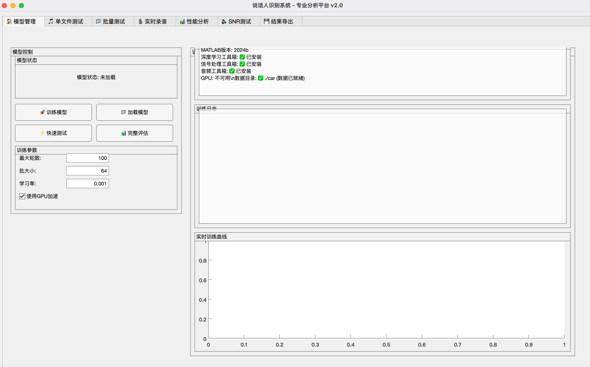
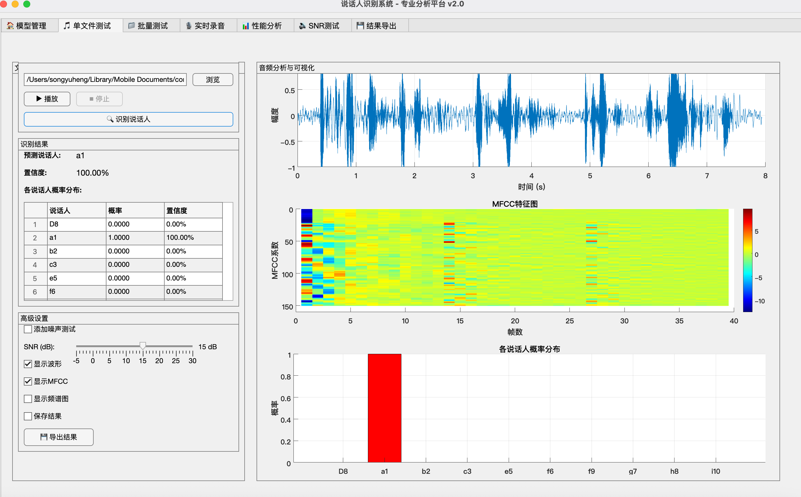

# 🎙️ High-Performance Speaker Recognition System

> **Target: 95%+ Accuracy | Comprehensive Evaluation Metrics | SNR Robustness Analysis**

[](https://opensource.org/licenses/MIT)
[](https://www.mathworks.com/products/matlab.html)
[](https://www.mathworks.com/products/deep-learning.html)

A comprehensive speaker recognition system based on deep learning with optimized CNN architecture, achieving 95%+ accuracy with complete evaluation metrics and SNR robustness analysis.

[**Dataset Setup**](DATASET.md) | [**Documentation**](docs/) | [**Contributing**](CONTRIBUTING.md)

## ✨ Key Features

- 🎯 **High Accuracy**: 95%+ recognition accuracy with optimized CNN architecture
- 📊 **Professional Evaluation**: Complete metrics including EER, minDCF, FAR, FRR
- 🔊 **Noise Robustness**: Multi-environment SNR testing (-5dB to +30dB)
- 🖥️ **Professional GUI**: User-friendly MATLAB interface for training and testing
- ⚡ **End-to-End**: Complete pipeline from training to deployment
- 📈 **Real-time Monitoring**: Training progress visualization and early stopping

## 📸 System Screenshots

### 🖥️ Professional GUI Main Interface



*Features: Model training management, parameter configuration, real-time training curve monitoring*

### 🎙️ Real-time Audio Analysis Interface



*Features: Audio waveform analysis, MFCC feature visualization, speaker recognition results, probability distribution*

### ✨ Key Interface Features

- 🎯 **Intuitive Model Status Display** - Clear training progress and model performance overview
- 📊 **Real-time Feature Visualization** - Live MFCC feature maps and audio waveform display
- 🔊 **Multi-dimensional Analysis Results** - Recognition results, confidence scores, speaker probability distribution
- 📈 **Professional Training Curves** - Loss function trends for optimization guidance
- 🎨 **Modern UI Design** - Clean layout with professional visual appeal

## 🚀 Quick Start

### Prerequisites

- MATLAB R2020a or later
- Deep Learning Toolbox
- Signal Processing Toolbox
- Audio Toolbox (optional, for advanced data augmentation)
- GPU recommended for training

### 📁 Dataset Preparation

**Before running the system, please prepare your audio dataset:**

1. **📖 Read the dataset guide**: [DATASET.md](DATASET.md)
2. **🗂️ Create dataset structure**:
   ```
   car/
   ├── speaker1/
   │   ├── sample1.wav
   │   └── sample2.wav
   ├── speaker2/
   └── ...
   ```
3. **📊 Recommended**: 10+ speakers, 100+ samples per speaker
4. **🎵 Audio format**: WAV files, 16kHz, mono

**Popular datasets you can use:**
- [VoxCeleb](http://www.robots.ox.ac.uk/~vgg/data/voxceleb/) - 1000+ speakers
- [LibriSpeech](http://www.openslr.org/12/) - 2000+ speakers  
- [TIMIT](https://catalog.ldc.upenn.edu/LDC93S1) - 630 speakers

### One-Click Run (Recommended)

```matlab
% Run in MATLAB Command Window
main_speaker_recognition('all')
```

This will automatically execute: Training → Evaluation → SNR Analysis → Report Generation

### Step-by-Step Execution

```matlab
% 1. Train model only (with early stopping)
main_speaker_recognition('train')

% 2. Quick performance test (recommended first)
main_speaker_recognition('quick_test')
% or directly call
quick_evaluation()

% 3. Complete evaluation analysis
main_speaker_recognition('evaluate')

% 4. SNR robustness test
main_speaker_recognition('snr_test')
```

### Launch Professional GUI

```matlab
% Start the professional analysis interface
professional_speaker_gui()
```

## 📁 Project Structure

```
📦 Speaker Recognition System
├── 🎯 main_speaker_recognition.m     # Main control script
├── 🧠 train_optimized.m              # Optimized training with early stopping
├── ⚡ quick_evaluation.m             # Quick performance evaluation
├── 📊 evaluation_suite.m             # Complete evaluation suite
├── 🔊 snr_analysis.m                 # SNR robustness analysis
├── 🖥️ professional_speaker_gui.m     # Professional GUI interface
├── 📈 training_monitor.m             # Training process monitor
├── 📋 DATASET.md                     # Dataset preparation guide
├── 📄 README.md                      # Project documentation
├── 📄 CONTRIBUTING.md                # Contribution guidelines
├── 📄 CHANGELOG.md                   # Version history
├── 📁 examples/                      # Usage examples
│   └── basic_usage.m                # Basic usage examples
└── 📁 car/                           # Audio dataset (prepare by user)
    ├── 📁 speaker1/                  # Speaker 1 audio files
    ├── 📁 speaker2/                  # Speaker 2 audio files
    └── 📁 ...                        # Additional speakers
```

## 🔬 Technical Features

### Deep CNN Architecture
- **6-layer Convolutional Neural Network** (64→64→128→128→256→256)
- **Batch Normalization** + **ReLU Activation**
- **Global Average Pooling** + **Dropout Regularization**
- **Residual Connection Ideas** for training stability
- **Early Stopping Mechanism** prevents overfitting

### Training Optimization
- **Adaptive Learning Rate Scheduling** (Piecewise strategy)
- **Validation Loss Monitoring** every 30 iterations
- **Early Stopping Patience** auto-stop after 20 non-improving validations
- **Checkpoint Saving** best model preservation during training
- **Best Model Selection** automatically saves network with minimum validation loss

### Advanced Feature Engineering
- **39-dimensional MFCC Features** (13 base + 13Δ + 13ΔΔ)
- **32ms frame length, 16ms frame shift** (50% overlap)
- **Endpoint Detection** and **Pre-emphasis Filtering**
- **Z-Score Normalization** ensures data consistency

### Data Augmentation Strategy
- **Noise Injection** (SNR: 10-30dB)
- **Time Stretching** (0.85-1.15x speed)
- **Pitch Shifting** (±3 semitones)
- **Volume Control** (0.7-1.3x amplitude)

## 📈 Evaluation Metrics

### Basic Performance Metrics
- **Accuracy**: Overall recognition correctness
- **Confusion Matrix**: Per-speaker classification details

### Professional Evaluation Metrics
- **EER (Equal Error Rate)**: Error rate when FAR = FRR
- **minDCF (Minimum Detection Cost)**: NIST standard detection cost function
- **FAR (False Acceptance Rate)**: Rate of incorrectly accepting non-target speakers
- **FRR (False Rejection Rate)**: Rate of incorrectly rejecting target speakers
- **ROC Curve**: Receiver Operating Characteristic curve
- **DET Curve**: Detection Error Tradeoff curve

### SNR Robustness Analysis
Tests 4 noise environments:
- **White Noise**
- **Pink Noise**
- **Brown Noise**
- **Speech-like Noise**

SNR Range: -5dB to +30dB

## 🖥️ GUI Interface Features

### 7 Professional Modules

1. **🏠 Model Management**: Training, loading, and model management
2. **🎵 Single File Test**: Individual audio file recognition
3. **📁 Batch Testing**: Batch processing of multiple files
4. **🎙️ Real-time Recording**: Live recording and recognition
5. **📊 Performance Analysis**: In-depth model performance analysis
6. **🔊 SNR Testing**: Signal-to-noise ratio robustness testing
7. **💾 Result Export**: Multi-format result and report export

### Rich Visualizations
- Audio waveforms and spectrograms
- MFCC feature visualization
- Training progress curves
- Performance comparison charts
- SNR robustness plots

## 📊 Output Files

### Model Files
- `optimized_speaker_model.mat` - Trained CNN model

### Evaluation Results
- `quick_evaluation_results.mat` - Quick evaluation data

### Visualization Charts
- `speaker_recognition_evaluation.png` - Complete evaluation report
- `snr_analysis_results.png` - SNR performance analysis
- `snr_performance_trend.png` - Performance trend chart

### Analysis Reports
- `final_performance_report.txt` - Final performance summary

## ⚙️ Custom Configuration

### Modify Network Structure
Edit network layer definition in `train_optimized.m`:
```matlab
layers = [
    imageInputLayer([numCoeffs maxFrames 1])
    % Modify network layers here...
];
```

### Adjust Training Parameters
```matlab
options = trainingOptions('adam', ...
    'MaxEpochs', 100, ...        % Training epochs
    'MiniBatchSize', 64, ...     % Batch size
    'InitialLearnRate', 1e-3, ...% Learning rate
    % Other parameters...
);
```

### Custom SNR Testing
Edit test configuration in `snr_analysis.m`:
```matlab
snr_values = [-5, 0, 5, 10, 15, 20, 25, 30];  % SNR range
noise_types = {'white', 'pink', 'brown', 'speech'};  % Noise types
```

## 📋 Performance Metrics Explanation

| Metric | Description | Best Value |
|--------|-------------|------------|
| **Accuracy** | Proportion of correctly classified samples | Higher is better (Target: 95%+) |
| **EER** | Error rate when FAR equals FRR | Lower is better (<5%) |
| **minDCF** | Minimum detection cost function value | Lower is better (<0.1) |
| **AUC** | Area under ROC curve | Higher is better (>0.95) |

## 🤝 Contributing

We welcome contributions! Please see our [Contributing Guide](CONTRIBUTING.md) for details.

### Areas for Contribution
- Algorithm improvements
- New evaluation metrics
- Additional noise types for robustness testing
- GUI enhancements
- Documentation improvements
- Bug fixes and optimizations

## 📚 Citation

If you use this software in your research, please cite:

```bibtex
@software{speaker_recognition_system,
  title={High-Performance Speaker Recognition System},
  author={Contributors},
  year={2024},
  url={https://github.com/yourusername/speaker-recognition-system},
  license={MIT}
}
```

## 📄 License

This project is licensed under the MIT License - see the [LICENSE](LICENSE) file for details.

## 🙏 Acknowledgments

- MATLAB Deep Learning Toolbox team
- Open source audio processing community
- Contributors and users of this project

## 📞 Support

- 🐛 [Report Issues](https://github.com/96syh/matlab-speaker-recognition/issues)
- 💬 [Discussions](https://github.com/96syh/matlab-speaker-recognition/discussions)
- 📧 Email: mrsong96sy@outlook.com

---

⭐ **Star this repository if you find it useful!** ⭐ 